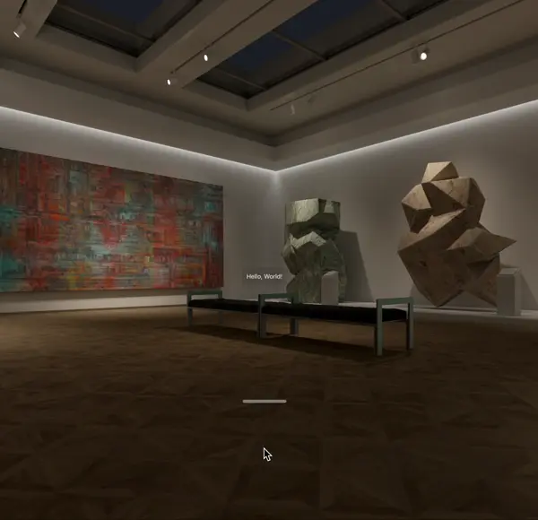
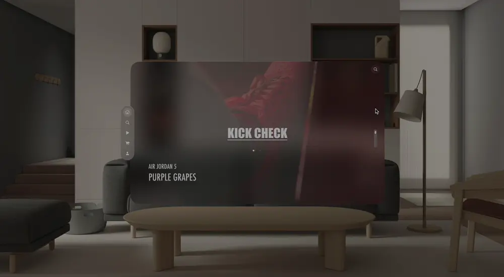
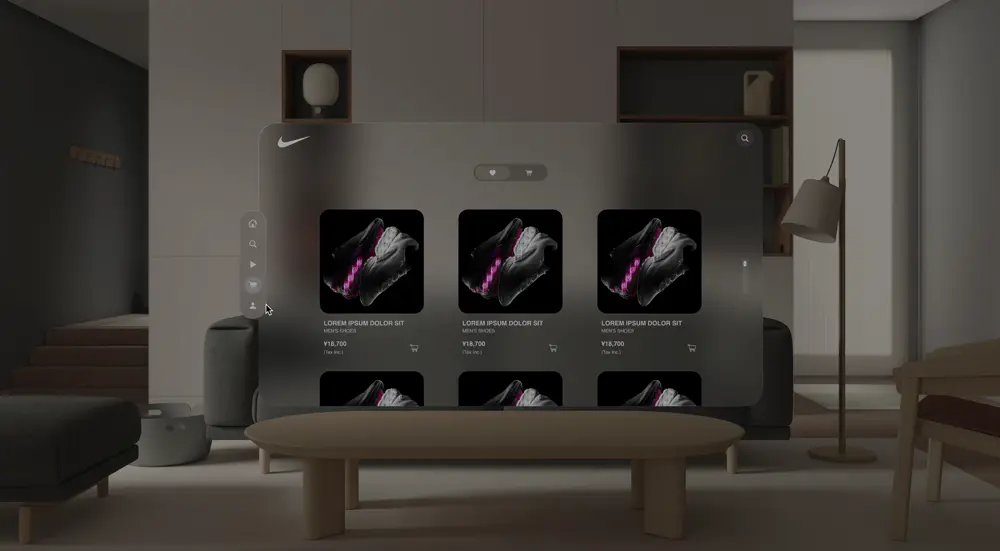
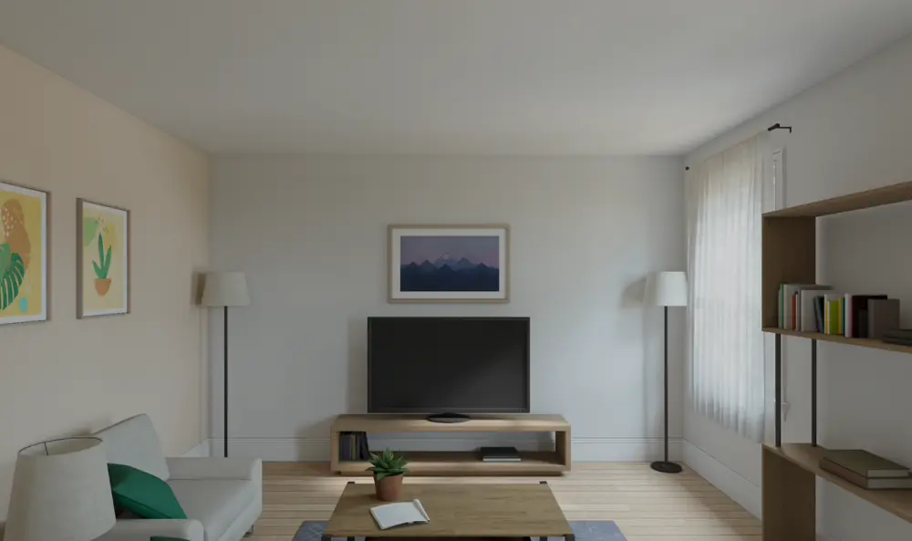

# visionOS Challenge

デザイナーから始めるvisionOS SwiftUI 事始めサンプル集。

デザイナー視点で、visionOSの空間UIを学びやすく整理した実装チャレンジです。
visionOSのUIや表現を、複雑な完成品としてではなく、基礎→応用の順で小さなサンプルに分解して実装しました。
Hello World、3D回転、アニメーション、動画、空間ビデオ、ECの商品詳細UIまでを段階的に試作し、デザイナーでも“見ながら・触りながら”理解しやすい入口をつくることを意識しています。
学習用メモといよりも、新しい空間体験を、設計と実装の両面から捉えるための実践的なアウトプットとして公開することを目的としました。

## 目次

- [visionOS Challenge](#visionos-challenge)
  - [目次](#目次)
  - [環境](#環境)
  - [サンプル一覧](#サンプル一覧)
    - [基礎サンプル](#基礎サンプル)
    - [ECアプリサンプル（仮想クライアント: Nike）](#ecアプリサンプル仮想クライアント-nike)

## 環境

- Xcode 15+
- visionOS 1.0+
- Swift 5.9+

## サンプル一覧

### 基礎サンプル

| Day  | Title                     | Description                                                                                   |                                              Preview                                               |
| :--- | :------------------------ | :-------------------------------------------------------------------------------------------- | :------------------------------------------------------------------------------------------------: |
| Day1 | Hello World               | visionOSの基本的な「Hello World」表示                                                         |                                                   |
| Day2 | objectRotate              | Apple Vision Proモデルを3軸方向に回転。スライダーで特定の角度に調整可能                       |                                                   |
| Day3 | objectRotate_inertia      | Day 2のアップデート版。スライダーを等分割し、タップすると最寄りの分岐点へポインターが自動移動 |                                                   |
| Day4 | Ai Animation              | AI応答時に表示するアニメーションモデル                                                        |                                                   |
| Day5 | LoadRemote3Dmodel + sound | 3Dモデルのランダム回転とサウンドの同時再生                                                    | <video loop src="https://github.com/user-attachments/assets/ede8f90f-0b2c-4323-b2f0-b7fe49ed5175"> |

### ECアプリサンプル（仮想クライアント: Nike）

| Day   | Title                                                                                                           | Description                                     |                                                                                                                                                                                                 Preview                                                                                                                                                                                                  |
| :---- | :-------------------------------------------------------------------------------------------------------------- | :---------------------------------------------- | :------------------------------------------------------------------------------------------------------------------------------------------------------------------------------------------------------------------------------------------------------------------------------------------------------------------------------------------------------------------------------------------------------: |
| Day6  | [UI Design](https://www.figma.com/design/AUx2AGFJUHC1imY0EKSxga/Sneakers?node-id=157-2815&t=upvz3Cl14WgpaaeF-1) | 全体のUIデザイン案と実装例                      |  |
| Day7  | SplashAnimation                                                                                                 | スプラッシュスクリーンのデモ                    |                                                                                                                                                                                                                                                                                                                                                         |
| Day8  | Slider_and_BgVideo                                                                                              | TOPページを想定したスライダーと背景動画の実装例 |                                                                                                                                                    <video loop src="https://github.com/user-attachments/assets/d43767f3-fabe-4ebb-b6b1-a5431b3982c1">                                                                                                                                                    |
| Day9  | Slider_BgVideo_SpatialVideo                                                                                     | Day 8を空間ビデオ用にアップデートした実装例     |                                                                                                                                                    <video loop src="https://github.com/user-attachments/assets/2866dd0b-ed06-48b8-8a17-d0b19380800e">                                                                                                                                                    |
| Day10 | ItemDetailView                                                                                                  | スニーカーの商品詳細ページ実装例                |                                                                                                                                                                                                                                                                                                                                                         |
